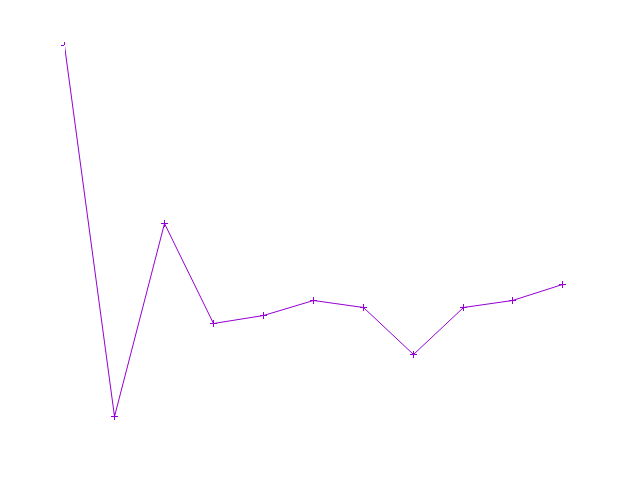

# Fitness

A visualization tool written in [rust](https://www.rust-lang.org/)

A super minimal approach, no website, just a script that parses a markdown file and updates the embedded chart.

The ./update.sh script produces a chart which shows the interval between bouts of activity.

 A markdown file 'Fitness.md' has this format

 ```markdown
# Fitness
12 October 2025
| Sun   | Mon   | Tue   | Wed   | Thu   | Fri   | Sat   |
| :-:   |:-:    |:-:    |:-:    |:-:    |:-:    |:-:    |
|   X   |   X   | 17:00 | 10:00 |  X    | 04:00 | 09:00 |
| 15:00 | 23:00 |   X   | 06:30 | 08:15 | 15:15 | 23:30 |
|   X   | 09:30 |       |       |       |       |       |


 ```

where 'X' or 'x' implies a skipped day. A empty cell is unfilled data.

Which render to : -
# Fitness
12 October 2025
| Sun   | Mon   | Tue   | Wed   | Thu   | Fri   | Sat   |
| :-:   |:-:    |:-:    |:-:    |:-:    |:-:    |:-:    |
|   X   |   X   | 17:00 | 10:00 |  X    | 04:00 | 09:00 |
| 15:00 | 23:00 |   X   | 06:30 | 08:15 | 15:15 | 23:30 |
|   X   | 09:30 |       |       |       |       |       |


 ## How the "./update.sh" script works

The script starts by passing the markdown into the rust binary and the program outputs a list of intervals

 eg

```txt
 24
 25
 30
 ```

The pipeline dumps the interval data into gnuplot which renders a png file.

```bash
 #!/bin/bash
rm fitness.png
cat Fitness.md | cargo run  | gnuplot fitness.gnuplot > fitness.png
```

 TODO

 The graphical color scheme is tuned to dark mode. -- The color scheme is hardcoded.